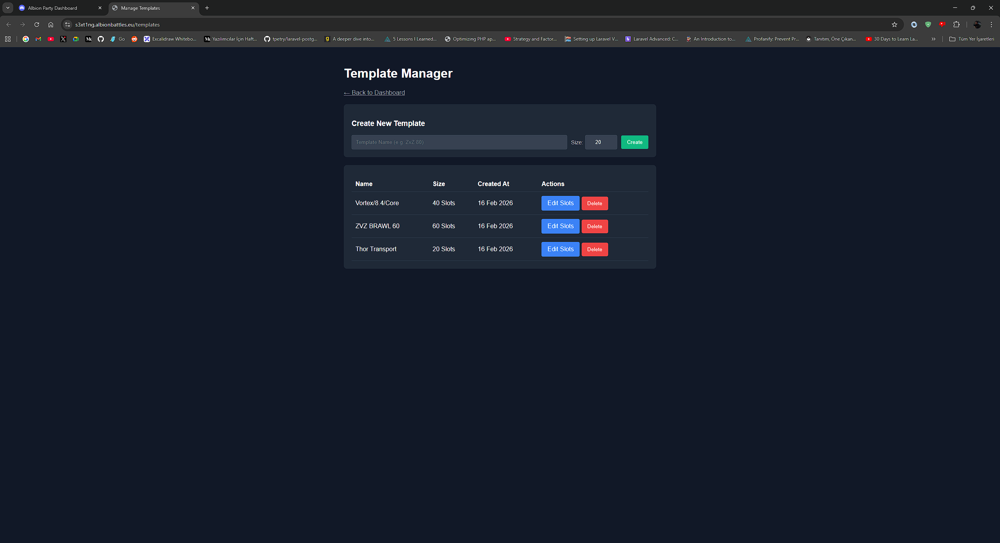
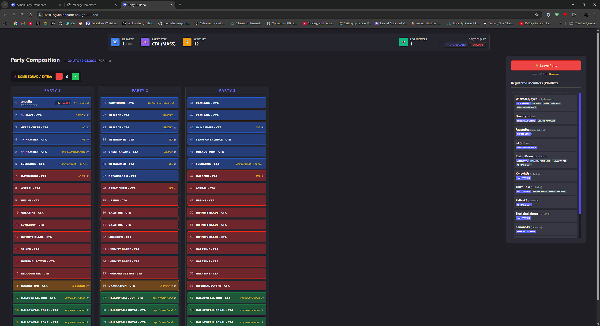
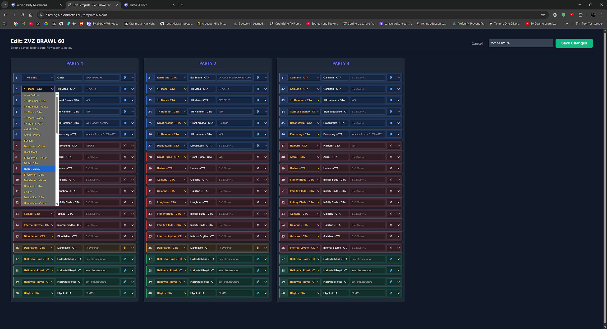
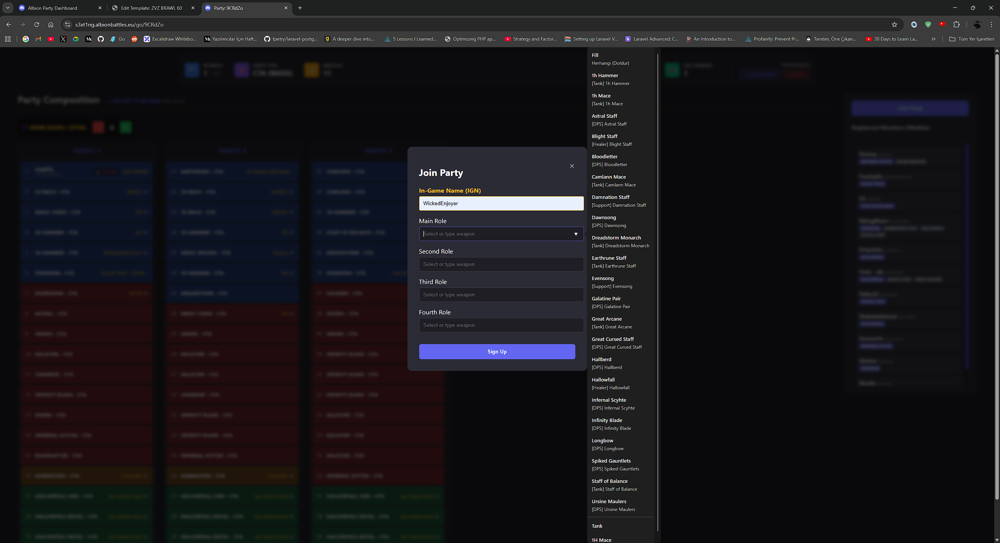
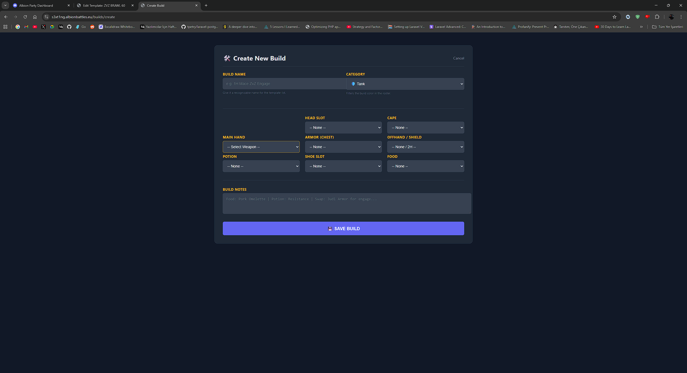
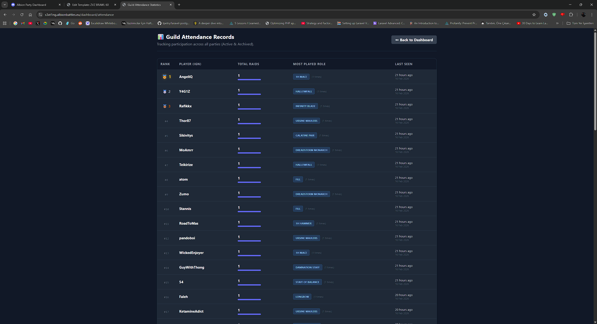

<div align="center">

# ⚔️ Albion Online Party Manager

**2v2 partileri için elektronik tabloların (Excel/Sheets) yerini almak üzere tasarlanmış, web tabanlı roster yönetim aracı.**


</div>

---

## 🚀 Key Features (Özellikler)

* **🛡️ Visual Roster:** Drag & Drop interface for managing party slots.
* **✅ Role Validation:** Ensures players select valid weapons for specific roles (Tank, Heal, DPS, Support).
* **💣 Dynamic Slots:** "Bomb Squad" or extra slots can be added instantly by Callers.
* **📊 Attendance System:** Tracks player attendance history and role preferences (Archived data support).
* **🔐 Discord Integration:** Secure login and authentication via Discord OAuth2.
* **⏳ Waitlist Management:** Automatic overflow system for players when the main party is full.
* **🛠️ Staff Tools:** Dedicated panel for Admins and Callers to manage templates and rosters.

---

## 💻 Tech Stack

* **Framework:** Laravel 12+ (PHP)
* **Database:** MySQL
* **Frontend:** Blade Templates, Vanilla JS (Drag & Drop), Custom CSS
* **Environment:** Docker & Docker Compose

---

## 🛠️ Getting Started (Local Development)

Follow steps for local development

### Needs
* Docker Desktop

### 1. Clone projkect
```bash
git clone https://github.com/badgeekduck/albion-party-manager.git
cd albion-party-manager
```

### 2. You need to set environments (Environment)
```bash
cp .env.example .env
APP_URL=http://localhost:8000

# Database Settings
DB_CONNECTION=mysql
DB_HOST=db
DB_PORT=3306
DB_DATABASE=albion_guild
DB_USERNAME=root
DB_PASSWORD=root

# Discord OAuth2 Settings
DISCORD_CLIENT_ID=your_client_id
DISCORD_CLIENT_SECRET=your_client_secret
DISCORD_REDIRECT_URI=http://localhost:8000/auth/discord/callback
```

### 3. Start container
```bash
docker-compose up -d --build
```

### 4. Install dependencies
```bash
docker-compose exec app composer install
```

### 5. ready to make db with migrations and generate a token for app
```bash
docker-compose exec app php artisan key:generate
docker-compose exec app php artisan migrate
```

### 6. You need Albion Online Items Data (Seed)
```bash
docker compose exec app php artisan db:seed --class=GameRoleSeeder
```

Setup is ready! Visit in your browser: http://localhost:8000


📂 Project Structure

* app/Http/Controllers: Dashboard, Attendance ve Party management logics.

* resources/views: Blade templates (party-screen.blade.php, dashboard.blade.php).

* routes/web.php: Your routes.

📂 Roles & Permissions
* System Admin: Dashboard, tepmlates ve staff all acess.

* Content Creator: Can make a link and can make their builds.

* Member: Only visits links that shared from admin, caller, content-creator

🤝 Contributing
* Fork the repo

* New feature name (branch) create (git checkout -b feature/amazing-feature).

* Make sure save your changes (git commit -m 'Add amazing feature').

* Push your branch (git push origin feature/amazing-feature).

* Make a pull request.















## Credits

- [Harun Baş](https://github.com/badgeekluck)
- [Mircea Maldo](https://github.com/mirceamoldo)

## New Features

- NEW FEATURES ARE ON THE WAY!
- WE ARE COOKING!
